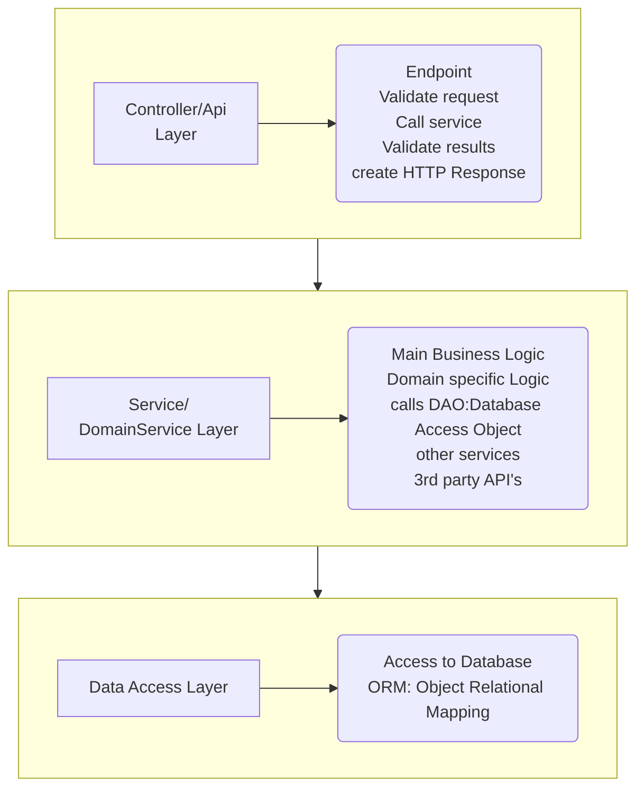

### food
 Food List Application

>  Exploring Spring(Boot) with Thymeleaf.
> In this Java Spring Boot and Thymeleaf Tutorial, you will be able to learn how to develop a simple Java Web app using Spring Boot MVC, Thymeleaf templating engine, Mybatis, and H2 in-memory database.

# Beginners Project
Watch the tutorial [here](https://www.youtube.com/watch?v=hoVUmn8ZCOo "Spring Boot Thymeleaf Tutorial for beginners")

* Use [Spring Initializer](https://start.spring.io/) to generate a project with:

|   Settings    | Using Dependencies: |
|:-------------:|:-------------------:|
| Maven project |       Lombok        |
|     Java      |     Spring Web      |
| Spring 2.7.4  |  MyBatisFramework   |
|      ...      |     H2 database     |

1. Generate, download, locate, unzip and open the project in your IDE
2. Go to src/main/java/""PROJECT FOLDER NAME"/java-class
3. click run to test your package in Spring Boot
4. check your POM.XML for dependencies

---
## Step-by-step
1. Make a controller package.
2. @Controller, @GetMapping, "/home" (Hello world!) on your localhost
3. create & connect dynamic content between template and controller
4. implement Model Class, use Lombok for Getters/Setters, skip boilerplate
5. add [Bootstrap](https://getbootstrap.com/ "Bootstrap") CSS and a [Table](https://getbootstrap.com/docs/5.2/content/tables/ "Bootstrap Table")
6. Make a table temmplate with thymeleaf references
7. inject array into template
- - create array in controller
- - echo array using thymeleaf
8. Add custom css file and path reference with thymeleaf
9. Build Service, remove array from controller, put it in service
10. add Service to controller
11. H2 database Configuration
12. create mapper to replace hardcoded array of foods
13. FORM and POST Request
14. INPUT into DB methods
- - Controller
- - Service
- - Database
> But it is easier to work backwards. If you start with controller and work your way down, all those functions don't exist and IntelliJ will make it red.
> Start to make an input for database, build a service, then build a controler.
15. Bind controller data to form [th:text="${food}"]
16. Add validation, success and error messages

> WARN 19660 --- [nio-8080-exec-2] .w.s.m.s.DefaultHandlerExceptionResolver : Resolved [org.springframework.web.method.annotation.ModelAttributeMethodProcessor$1: org.springframework.validation.BeanPropertyBindingResult: 1 errors<EOL>Field error in object 'food' on field 'price': rejected value [null]; codes [typeMismatch.food.price,typeMismatch.price,typeMismatch.double,typeMismatch]; arguments [org.springframework.context.support.DefaultMessageSourceResolvable: codes [food.price,price]; arguments []; default message [price]]; default message [Failed to convert value of type 'null' to required type 'double'; nested exception is org.springframework.core.convert.ConversionFailedException: Failed to convert from type [null] to type [double] for value 'null'; nested exception is java.lang.IllegalArgumentException: A null value cannot be assigned to a primitive type]]

# TRIVIA
## Abstraction Layers
