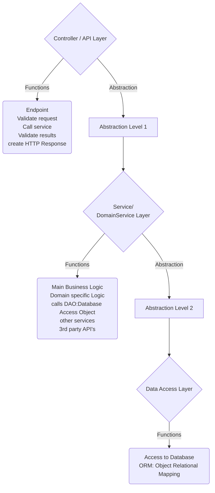

### food
 Food List Application

>  Exploring Spring(Boot) with Thymeleaf.

# Beginners Project
Watch the tutorial [here](https://www.youtube.com/watch?v=hoVUmn8ZCOo "Spring Boot Thymeleaf Tutorial for beginners")

* Use [Spring Initializer](https://start.spring.io/) to generate a project with:

|   Settings    | Using Dependencies: |
|:-------------:|:-------------------:|
| Maven project |       Lombok        |
|     Java      |     Spring Web      |
| Spring 2.7.4  |  MyBatisFramework   |
|      ...      |     H2 database     |

1. Generate, download, locate, unzip and open the project in your IDE
2. Go to src/main/java/""PROJECT FOLDER NAME"/java-class
3. click run to test your package in Spring Boot
4. check your POM.XML for dependencies

---
## Step-by-step
1. Make a controller package.
2. @Controller, @GetMapping, "/home" (Hello world!) on your localhost
3. create & connect dynamic content between template and controller
4. implement Model Class, use Lombok for Getters/Setters, skip boilerplate
5. add [Bootstrap](https://getbootstrap.com/ "Bootstrap") CSS and a [Table](https://getbootstrap.com/docs/5.2/content/tables/ "Bootstrap Table")
6. Make a table temmplate with thymeleaf references
7. inject array into template
- - create array in controller
8. Add custom css file and path reference with thymeleaf

# TRIVIA
## Abstraction Layers
